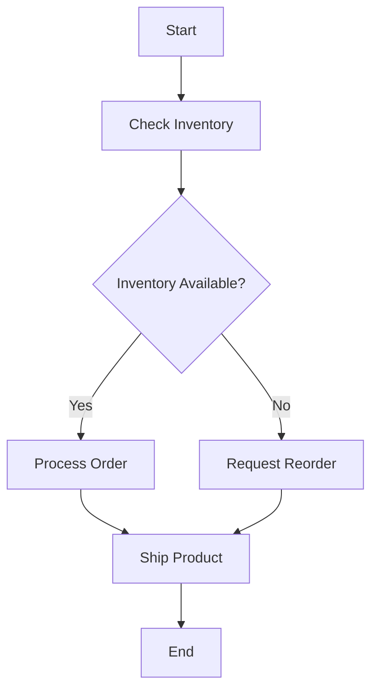

# 🪑 Root-Cause-Analyses-in-Food-production-facility-using-Excel
This repository contains case studies set in real-life Food production facility that are analyzed using Excel

---

## 🗝 Cause and Effect diagram
- It is used to find the root cause and the potential solutions to the problem
- It systematically helps a team break down a problem into several components
- It displays the possible causes in a graphical manner
- It is also known as Fishbone diagram or Ishikawa diagram

### Steps
1. Determine the main classification or headings to group the causes
2. Draw a cause and effect diagram with the problem at the point of the central axis line
3. Brainstorm possible causes of the problem
4. Write the causes on the diagram under classification chosen

### Cause and effect matrix
- The prioritization number reflects the effect of each input variable on the output variable
- The process output priority is multiplied with the input variables to arrive at the result for each input variable

### Sample diagram

---

## 📥 The 5 Whys Technique
- Identify the problem and the problem statement
- Arrange for a team brainstorming session
- Explain the purpose
- Analyze the problem and brainstorm backwards
- Ask "Why?" for the answers obtained
- *If a problem occurs, it is usually due to the process and not because of the person or team*

---

