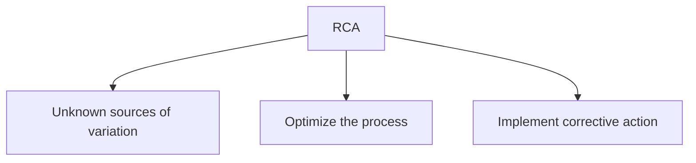
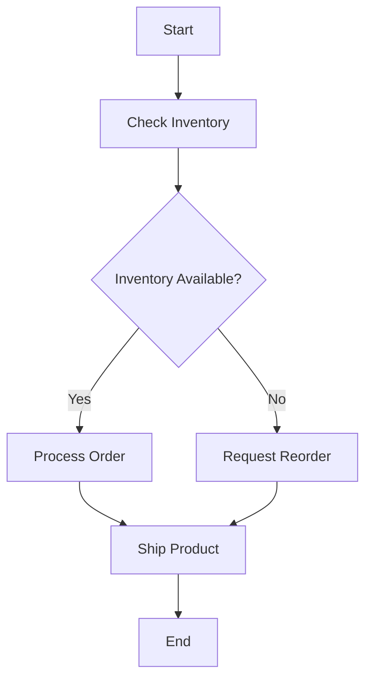

# 🪑 Root-Cause-Analyses-in-Food-production-facility-using-Excel
This repository contains case studies set in real-life Food production facility that are analyzed using Minitab

---

## 🦺 Root Cause Analysis (RCA)
In Improve phase, a root cause is a factor that causes the defector issue. Removing that factor will prevent the re-occurence of the issue

    Evaluate --> Optimize --> Validate

---

## 🗝 Cause and Effect diagram
- It is used to find the root cause and the potential solutions to the problem
- It systematically helps a team break down a problem into several components
- It displays the possible causes in a graphical manner
- It is also known as Fishbone diagram or Ishikawa diagram

### Steps
1. Determine the main classification or headings to group the causes
2. Draw a cause and effect diagram with the problem at the point of the central axis line
3. Brainstorm possible causes of the problem
4. Write the causes on the diagram under classification chosen

### Cause and effect matrix
- The prioritization number reflects the effect of each input variable on the output variable
- The process output priority is multiplied with the input variables to arrive at the result for each input variable

### Sample diagram

---

## 📥 The 5 Whys Technique
- Identify the problem and the problem statement
- Arrange for a team brainstorming session
- Explain the purpose
- Analyze the problem and brainstorm backwards
- Ask "Why?" for the answers obtained
- *If a problem occurs, it is usually due to the process and not because of the person or team*

---

## 👔 Case study: Cause & Effect (Fishbone/Ishikawa) diagram to handle issue in food production facility

### Issue
Frequent production halts in a packaged food line due to packaging defects

### Fishbone categories
- **Man**: Untrained staff, fatigue
- **Machine**: Misaligned sealing machine, low maintenance
- **Material**: Poor packaging quality, wrong bag size
- **Method**: Ineffective SOP, poor inspection process
- **Measurement**: No inline defect tracking, delay in feedback
- **Environment**: High humidity, dust contamination

### VBA macro for Fishbone diagram

            Sub CreateFishboneDiagramWithSubcategories()
    Dim ws As Worksheet
    Set ws = ActiveSheet
    
    ' Delete all shapes
    ' Dim shp As Object
    ' For Each shp In ws.Shapes
       ' shp.Delete
    ' Next shp
    
    ' Main Spine
    Dim xStart As Single: xStart = 100
    Dim xEnd As Single: xEnd = 700
    Dim yCenter As Single: yCenter = 300
    Dim xStep As Single: xStep = 100
    Dim yOffset As Single: yOffset = 40
    
    ' Add spine
    Dim spine As Shape
    Set spine = ws.Shapes.AddLine(xStart, yCenter, xEnd, yCenter)
    spine.Line.EndArrowheadStyle = msoArrowheadTriangle
    
    ' Categories and subcauses
    Dim categories As Variant
    Dim subcauses As Variant
    
    categories = Array("Man", "Machine", "Method", "Material", "Measurement", "Environment")
    subcauses = Array( _
                Array("Untrained staff", "Fatigue"), _
                Array("Seal misalignment", "Maintenance delay"), _
                Array("No SOP", "Missed checks"), _
                Array("Low quality", "Wrong size"), _
                Array("No inspection", "Delay feedback"), _
                Array("Humidity", "Dust contamination") _
                )
    
    Dim i As Integer, j As Integer
    Dim catX As Single, catY As Single
    Dim branchX As Single, branchY As Single
    Dim angleUp As Boolean
    
    ' Draw branches
    For i = 0 To 5
        angleUp = (i < 3)
        catX = xEnd - xStep * (i + 1)
        catY = yCenter + IIf(angleUp, -1, 1) * yOffset * (i + 1)
        
        ' Main branch
        ws.Shapes.AddLine(catX, catY, xEnd, yCenter).Line.Weight = 1.5
        ws.Shapes.AddTextbox(msoTextOrientationHorizontal, catX - 40, catY + IIf(angleUp, -20, 5), 100, 15).TextFrame.Characters.Text = categories(i)
    
        ' Sub-causes
        For j = 0 To 1
            branchX = catX - 60
            branchY = catY + IIf(angleUp, -1, 1) * 20 * (j + 1)
            
            ' Diagonal line from main branch
            ws.Shapes.AddLine(branchX, branchY, catX, catY).Line.Weight = 1
            ' ws.Shapes.AddTextbox(msoTextOrientationDownward, branchX - 50, branchY + IIf(angleUp, -15, 5), 100, 15).TextFrame.Characters.Text = subcauses(i)(j)
        
        ' Rotated sub-cause text
        Dim txt As Shape
        Set txt = ws.Shapes.AddTextbox(msoTextOrientationHorizontal, branchX - 50, branchY - 10, 80, 20)
        txt.TextFrame.Characters.Text = subcauses(i)(j)
        txt.TextFrame2.Orientation = msoTextOrientationHorizontal
        txt.Rotation = IIf(angleUp, -30, 30)
       Next j
    Next i
    
    ' Add problem statement
    ws.Shapes.AddTextbox(msoTextOrientationHorizontal, xEnd + 10, yCenter - 10, 200, 20).TextFrame.Characters.Text = "Problem: Packaging Defects"
    
    MsgBox "Fishbone Diagram with subcategories created!", vbInformation
    End Sub

